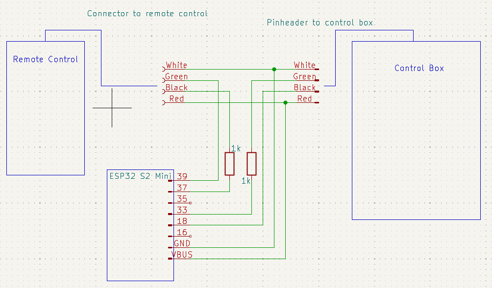
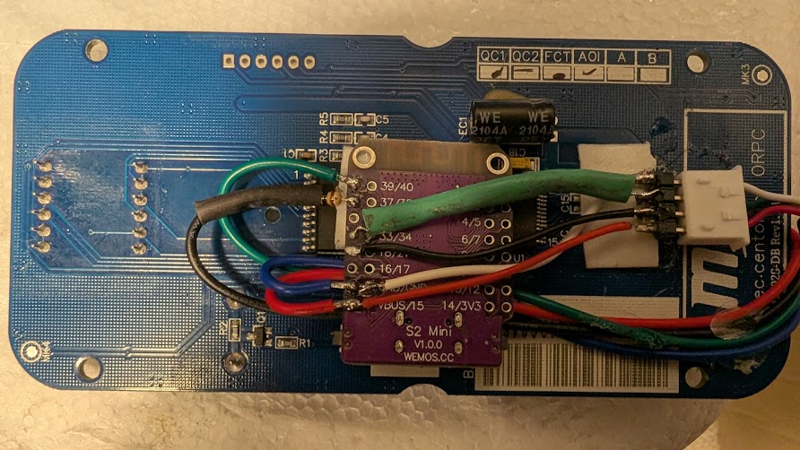
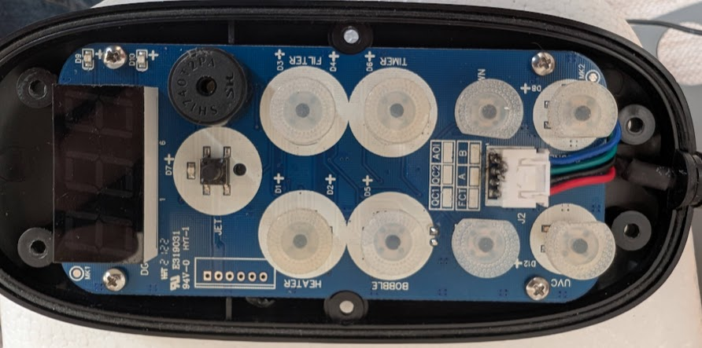
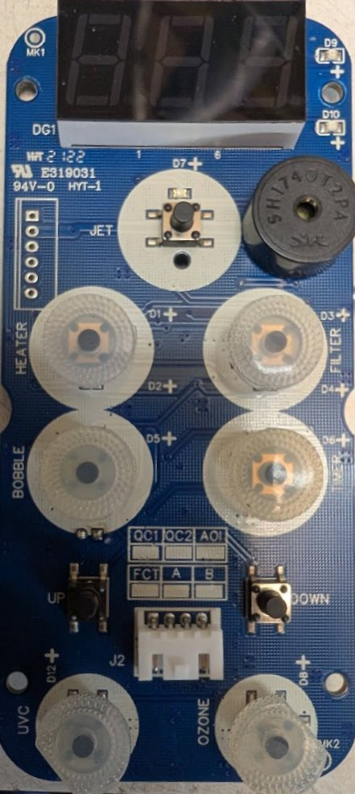

# mspa-wifi

This project explains how to add Wi-Fi connectivity to the M-Spa Aurora Urban U-AU062 using ESPHome,
enabling integration with Home Assistant. This is done by adding an ESP32-S2 module inside the
remote control that intercepts the traffic between the remote control and control box.


# Build your own

## Required Items

 * 1 pcs [S2 Mini V1.0.0 ESP32-S2 module](https://www.amazon.se/dp/B0BGPD6CV5)
 * 2 pcs [1k Ohm restistor](https://www.amazon.se/dp/B0DWK5KSBF)
 * [2.54 mm header](https://www.amazon.se/dp/B0DYDBSTGJ)
 * Connector for the remote
 * Some cables, soldering iron, glue gun etc.

## Program Your ESP-32 module, command line version

Read [Getting Started with the ESPHome Command Line](https://esphome.io/guides/getting_started_command_line/)

Download or clone the repository, e.g.:

```
git clone https://github.com/johannesc/mspa-wifi.git
```

Create a esphome/secrets.yaml with content:

```
wifi_ssid: <Your Wi-Fi SSID>
wifi_password: <Your Wi-Fi Passoword>

mspa_password: <A password of your choice>
mspa_api_key: <Home Assistant>
```

An esphome API key can be created [here](https://esphome.io/components/api.html)

Connect your module using a USB-C cable and program it (press and hold the "O" button while pressing and releasing the RST button to put in programming mode):
```
$ pip install esphome
$ cd esphome
$ esphome run mspa-wifi.yaml
```
## Add the Mspa device to Home Assistant

Go to Settings/Devices & Services/ESPHome and press "ADD DEVICE". If this is your first ESPHome
device you probably need to add the ESPHome integration first.

For more information see [Connecting your device to Home Assistant](https://esphome.io/guides/getting_started_hassio.html#connecting-your-device-to-home-assistant).

## If you don't have Home Assistant

Make sure to add `reboot_timeout: 0s` to the `mspa-wifi.yaml` to prevent it from rebooting every 15 minutes.

## Modifying your Remote

Below picture shows how to connect your hardware. Everything fits inside the M-Spa remote control
(it is a bit tight though). The 1 k resistors are used to limit the current as the M-Spa uses 5 v
while the ESP32-S2 uses 3.3 v.






## Ready To Use

You should now be ready to control your M-Spa through Home Assistant or through your browser
at [http://mspa.local/](http://mspa.local/).

# M-Spa protocol and Hardware Description

## Hardware

### Control Box
The control board inside the control box:


The microcontroller is a PIC16F723A:


The connector to the remote control can be seen in the upper right corner. The pinout:

| Color | Description                        |
|-------|------------------------------------|
| White | GND                                |
| Green | Tx (control box to remote control) |
| Black | Rx (remote control to control box) |
| Red   | +5v                                |

### Remote Control




The microcontroller is a PIC16F723A. The chip at the top is a TM1620 (LED driver).

Unmounted Pin Header

| Pin #   | Description                        |
|---------|------------------------------------|
| 1 (top) | PIC16F723A Pin #1 (/MCLR)          |
| 2       | PIC16F723A Pin #19 (VDD)           |
| 3       | GND                                |
| 4       | PIC16F723A Pin #28 (ICSPDAT)       |
| 5       | PIC16F723A Pin #27 (ICSPCLK)       |
| 6       | NC?                                |


## Protocol

UART Settings 9600 bps 8N1. 4 byte packets.

See `scripts/mspa_decoder.py` for example decoding of the protocol.

Captured data:


### Example Packets

#### From Control Box:
| Data | Description                   |
|------|-------------------------------|
|0xA5  | Packet start                  |
|0x06  | Temperature reading           |
|0x1C  | Temp = 0x1C/2 = 14.0 degrees  |
|0xC7  | Checksum = 0xA5 + 0x06 + 0X1C)|

More examples:

    0xA5 0x08 0x00 0xAD
    0xA5 0x0B 0x86 0x36

    Flow On?
    A5 08 01 AE

    A5 0B 86 36

#### From Remote

    Timestamp: Data
    0.30: A5 03 00 A8
    1.81: A5 0D 00 B2
    3.31: A5 0E 00 B3
    4.81: A5 15 00 BA
    4.91: A5 01 00 A6
    6.31: A5 02 00 A7

    Press - one time (temp at 40 degrees)
    110.67: A5 16 00 BB
    110.67: A5 04 28 D1

    Press - until 35 degrees:
    173.09: A5 04 23 CC

    Heater On:
    A5 02 01 A8
    A5 16 00 BB

    Filter On:
    A5 02 01 A8
    A5 16 00 BB


### Power On Sequence

    /dev/ttyUSB0: 5.46: New Command: A5 09 00 AE: Unknown command A5 09 00 AE
    /dev/ttyUSB0: 5.66: New Command: A5 07 0C B8: Unknown command A5 07 0C B8
    /dev/ttyUSB1: 5.89: New Command: A5 0B 00 B0: Unknown command A5 0B 00 B0
    /dev/ttyUSB1: 5.89: New Command: A5 0A 00 AF: Unknown command A5 0A 00 AF
    /dev/ttyUSB0: 5.89: New Command: A5 0B 86 36: Unknown command A5 0B 86 36
    /dev/ttyUSB0: 5.89: New Command: A5 0A 01 B0: Unknown command A5 0A 01 B0
    /dev/ttyUSB1: 5.90: New Command: A5 11 00 B6: Unknown command A5 11 00 B6
    /dev/ttyUSB0: 5.91: New Command: A5 11 00 B6: Unknown command A5 11 00 B6
    /dev/ttyUSB1: 5.91: New Command: A5 10 00 B5: Unknown command A5 10 00 B5
    /dev/ttyUSB0: 5.92: New Command: A5 10 00 B5: Unknown command A5 10 00 B5
    /dev/ttyUSB0: 6.06: New Command: A5 06 2F DA: Temp report: 23.5 °C
    /dev/ttyUSB1: 6.09: New Command: A5 01 00 A6: Heater enabled: False
    /dev/ttyUSB0: 6.87: New Command: A5 08 00 AD: Flow report: In: False, out: False
    /dev/ttyUSB0: 7.08: Old Command: A5 06 2F DA: Temp report: 23.5 °C
    /dev/ttyUSB1: 7.49: New Command: A5 02 00 A7: Set filter: False
    /dev/ttyUSB0: 7.89: Old Command: A5 08 00 AD: Flow report: In: False, out: False
    /dev/ttyUSB0: 8.09: Old Command: A5 06 2F DA: Temp report: 23.5 °C
    /dev/ttyUSB0: 8.90: Old Command: A5 08 00 AD: Flow report: In: False, out: False
    /dev/ttyUSB1: 8.99: New Command: A5 03 00 A8: Set bubble speed: 0
    /dev/ttyUSB0: 9.11: Old Command: A5 06 2F DA: Temp report: 23.5 °C
    /dev/ttyUSB0: 9.92: Old Command: A5 08 00 AD: Flow report: In: False, out: False
    /dev/ttyUSB0: 10.12: Old Command: A5 06 2F DA: Temp report: 23.5 °C
    /dev/ttyUSB1: 10.50: New Command: A5 0D 00 B2: Unknown command A5 0D 00 B2
    /dev/ttyUSB1: 10.90: New Command: A5 0F 00 B4: Unknown command A5 0F 00 B4
    /dev/ttyUSB0: 10.93: Old Command: A5 08 00 AD: Flow report: In: False, out: False
    /dev/ttyUSB0: 11.13: Old Command: A5 06 2F DA: Temp report: 23.5 °C
    /dev/ttyUSB0: 11.94: Old Command: A5 08 00 AD: Flow report: In: False, out: False
    /dev/ttyUSB1: 12.00: New Command: A5 0E 00 B3: Ozone enabled: False
    /dev/ttyUSB0: 12.15: Old Command: A5 06 2F DA: Temp report: 23.5 °C
    /dev/ttyUSB0: 12.96: Old Command: A5 08 00 AD: Flow report: In: False, out: False
    /dev/ttyUSB0: 13.16: Old Command: A5 06 2F DA: Temp report: 23.5 °C
    /dev/ttyUSB1: 13.51: New Command: A5 15 00 BA: Set UVC: False
    /dev/ttyUSB1: 13.61: Old Command: A5 01 00 A6: Heater enabled: False
    /dev/ttyUSB0: 13.97: Old Command: A5 08 00 AD: Flow report: In: False, out: False
    /dev/ttyUSB0: 14.17: Old Command: A5 06 2F DA: Temp report: 23.5 °C
    /dev/ttyUSB0: 14.98: Old Command: A5 08 00 AD: Flow report: In: False, out: False
    /dev/ttyUSB1: 15.01: Old Command: A5 02 00 A7: Set filter: False
    ....

#### Set Target Temp
    /dev/ttyUSB1: 75.14: Old Command: A5 02 00 A7: Set filter: False
    /dev/ttyUSB1: 75.57: Old Command: A5 01 00 A6: Heater enabled: False
    /dev/ttyUSB1: 75.57: Old Command: A5 02 00 A7: Set filter: False
    /dev/ttyUSB1: 75.57: Old Command: A5 03 00 A8: Set bubble speed: 0
    /dev/ttyUSB1: 75.57: Old Command: A5 0D 00 B2: Unknown command A5 0D 00 B2
    /dev/ttyUSB1: 75.57: Old Command: A5 0E 00 B3: Ozone enabled: False
    /dev/ttyUSB1: 75.57: Old Command: A5 15 00 BA: Set UVC: False
    /dev/ttyUSB1: 75.57: New Command: A5 16 00 BB: Unknown command A5 16 00 BB
    /dev/ttyUSB1: 75.57: New Command: A5 04 25 CE: Set temp: 37 °C
    /dev/ttyUSB0: 75.77: Old Command: A5 08 00 AD: Flow report: In: False, out: False
    /dev/ttyUSB0: 75.97: Old Command: A5 06 30 DB: Temp report: 24.0 °C
    /dev/ttyUSB1: 76.65: Old Command: A5 03 00 A8: Set bubble speed: 0
    /dev/ttyUSB0: 76.78: Old Command: A5 08 00 AD: Flow report: In: False, out: False
    /dev/ttyUSB0: 76.99: Old Command: A5 06 30 DB: Temp report: 24.0 °C
    /dev/ttyUSB0: 77.80: Old Command: A5 08 00 AD: Flow report: In: False, out: False
    /dev/ttyUSB0: 78.00: Old Command: A5 06 2F DA: Temp report: 23.5 °C
    /dev/ttyUSB1: 78.15: Old Command: A5 0D 00 B2: Unknown command A5 0D 00 B2

### Decoded Protocol

| Offset | Description                     |
|--------|---------------------------------|
| 0      | Packet start                    |
| 1      | Command (see table below)       |
| 2      | Parameter                       |
| 3      | Checksum (sum of offset 0, 1, 2)|


| Command | Description                     |
|---------|---------------------------------|
| 0x01    | Set Heater                      |
| 0x02    | Set Filter                      |
| 0x03    | Set Bubble                      |
| 0x04    | Set Target Temperature          |
| 0x05    | ?                               |
| 0x06    | Temp Report (sent each second)  |
| 0x07    | ?                               |
| 0x08    | Flow Report (sent each second)  |
| 0x09    | ?                               |
| 0x0A    | ?                               |
| 0x0B    | Get/Report timer. Sent 1 / min from remote (value 0x00) filter pump replies direct with a value that increase for every hour |
| 0x0C    | ?                               |
| 0x0D    | Sent 8 times / min (7.5 s period) from remote |
| 0x0E    | Set Ozone                       |
| 0x0F    | ?                               |
| 0x10    | ?                               |
| 0x11    | ?                               |
| 0x12    | ?                               |
| 0x13    | ?                               |
| 0x14    | ?                               |
| 0x15    | Set UVC                         |
| 0x16    | ?                               |
| 0x17    | ?                               |
